# Migración de Página XAMP a LAMP

Dentro de este fichero creamos nuestra página en nuestro servidor local y le ponemos esta IP

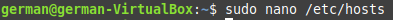

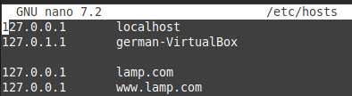

Creamos este fichero en la ruta /var/www/html y lo copiamos en la carpeta donde va a estar toda nuestra estructura de la página

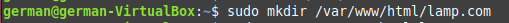

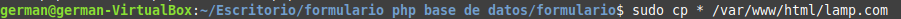

Entramos a etc/apache2/sites-available y creamos un archivo llamado (nombre-de-la-página).conf y le ponemos el siguiente código

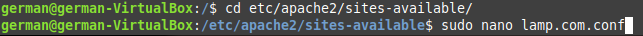

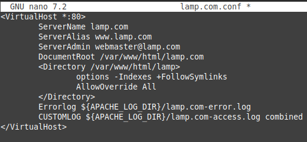

Habilitamos el archivo que acabamos de crear

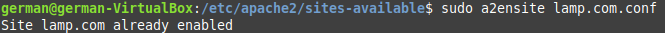

Instalamos phpmyadmin

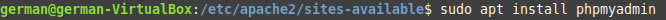

Entramos en esta ruta y creamos el siguiente fichero, poniendole el siguiente código

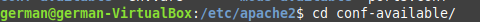

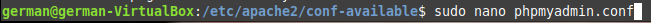

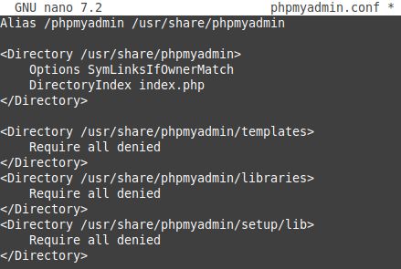

Dentro de MariaDb creamos una base de datos phpmyadmin, que debería estar creada ya, pero lo comprobamos, y le damos privilegios al usuario que creamos en la práctica anterior

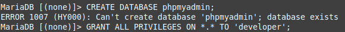

Dentro de phpmyadmin en el buscador importamos la base de datos que tenía XAMP

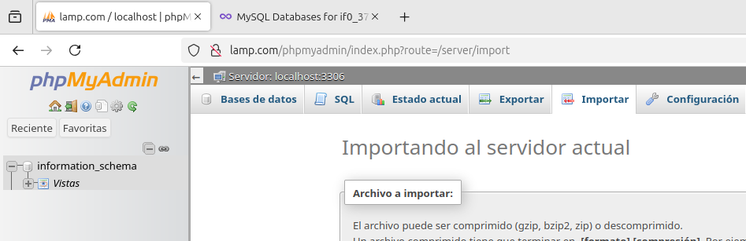

Y yendo al apartado de bases de datos comprobamos que se haya importad correctamente

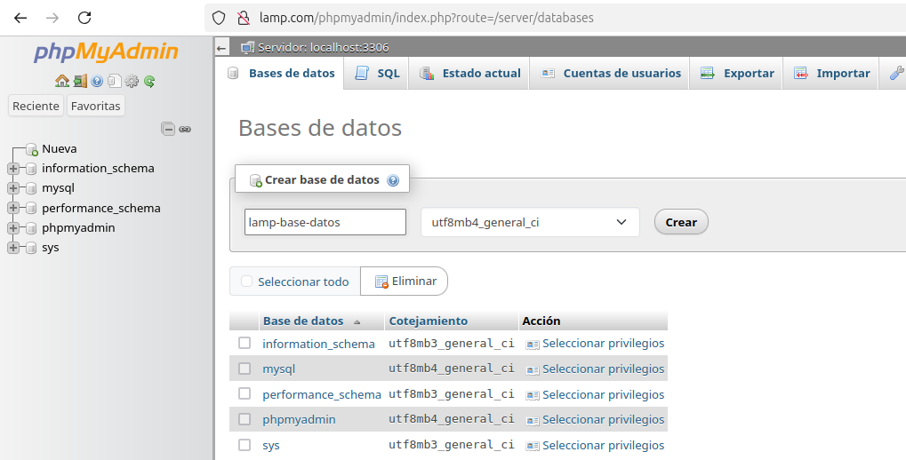