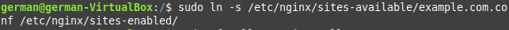

# Certificado Let's Encrypt y protección CertBot en Nginx

Instalamos los paquetes necesarios para esta práctica.

Entramos en nuestro fichero de configuración de nginx y ponemos el siguiente código.

Creamos un enlace simbólico del fichero de configuración para activarlo después en nuestro servidor

Tenemos que dejar que el tráfico HTTPS entre en el servidor, para ello usaremos el siguiente comando:

Y con este último comando generaremos el certificado de CertBot

