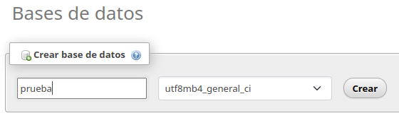
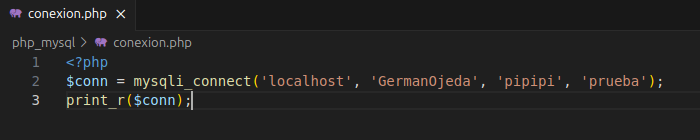
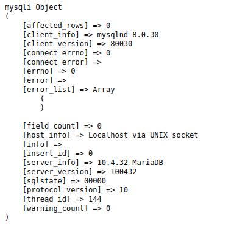
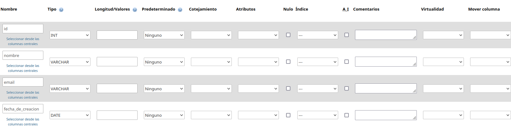

# Creación y conexion a bases de datos

### Creamos la base de datos dentro de Localhost en phpmyadmin

### La clase ya está creada

### En un fichero php dentro de htdocs escribimos este código para hacer la conexión a la base de datos

### Con esto podemos ver que la conexión funcionó

### Dentro de phpmyadmin en nuestro Localhost en la parte de bases de datos, entramos y creamos estas 4 columnas en nuestra base de datos llamada "prueba"

