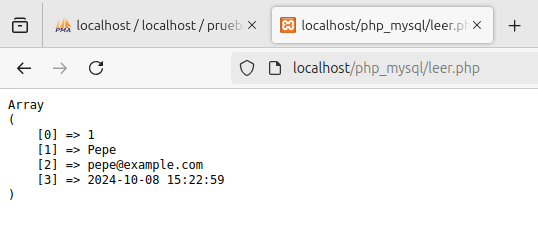

# Insertar, Leer, Modificar y Borrar

## Insert

Para insertar código en nuestra base de datos con un fichero php se utiliza el siguiente código, haciendo la conexión a la base de datos con "$conn", luego escribiendo el comando SQL en "$insert" y haciendo el insert con "$return", después con "print_r" comprobamos que el insert se hizo correctamente.

Gracias al "print_r" podemos ver que el insert se hizo correctamente ya que nos puso un 1 en la página.

Aquí vemos que el insert surtió efecto en la base de datos

## Lectura

Con este código hacemos la lectura, en "$sql" en vez de hacer una sentencia Insert, hacemos un Select, luego con "$rows" escogemos la respuesta de la lectura y el "print_r" para que nos lo ponga en la página.

Vista de que la lectura se hizo correctamente.

Este es como el código anterior pero hacemos un bucle para que nos enseñe todas las filas de la tabla en la base de datos.

Aquí podemos ver que se a hecho el bucle correctamente.

## Update

Este es el código PHP que se utiliza para hacer un update, es muy parecido al código del Insert.

Aquí podemos ver que nos da 1, es decir que el update se hizo correctamente.

Y aquí vemos que el update surtió efecto en la base de datos.

## Delete

Este es el código que se usa para hacer un Delete en una tabla de la base de datos, reitero, muy parecido al Insert/Update.

La comprobación de que el Delete surtió efecto.

Y aquí la base de datos, que vemos que el registro con ID=1 fue eliminado.

