# Instalación de servidor LAMP

Primero actualizamos los paquetes de nuestra máquina

Actualizamos todos los paquetes instalados

Más tarde instalamos apache con el siguiente comando

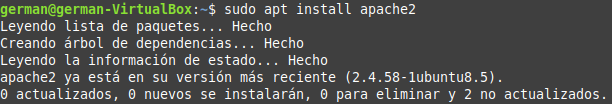

Instalamos el servidor y cliente de MariaDB

Aqui podemos ver que el servicio de MariaDB está activo

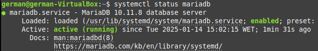

Aquí activamos el servicio de MariaDB, aunque normalmente cuando instalas un paquete este viene activo, nunca está de más comprobarlo.

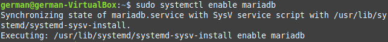

Revisamos que la versión sea la más nueva

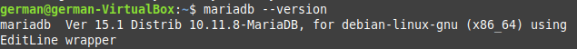

Instalamos el script de seguridad de MySQL

Entramos a MariaDB como root

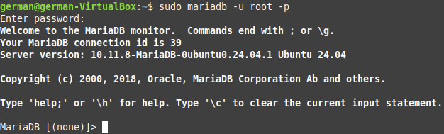

Creamos el usuario developer

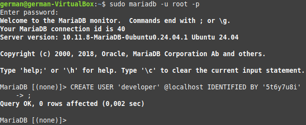

Instalamos PHP

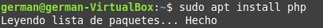

Habilitamos PHP

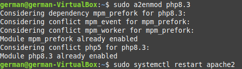

Y miramos que version tenemos instalada

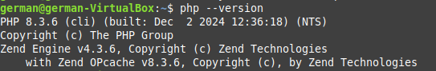

Creamos este ficher en la ruta /var/www/html y escribimos lo siguiente

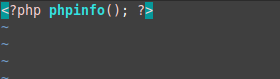

Accedemos al fichero que acabamos de crear desde el buscador que tengamos, y si lo hemos hecho todo bien nos debería salir la siguiente página

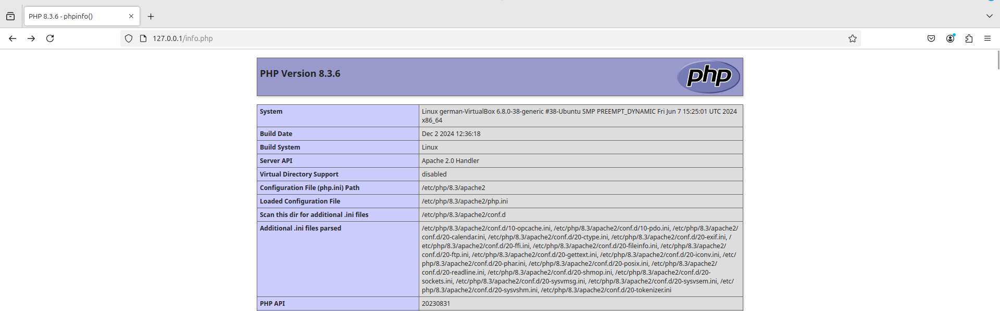

Ahora deshabilitaremos PHP

Ahora con PHP deshabilitado instalaremos el siguiente paquete para ejecutar código en PHP.

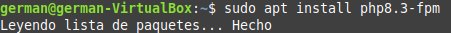

Habilitamos el siguiente paquete

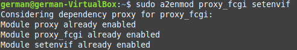

Y configuramos lo instalado previamente

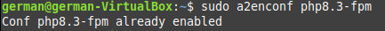

Y si lo hemos hecho todo bien pues aparecerá esta página

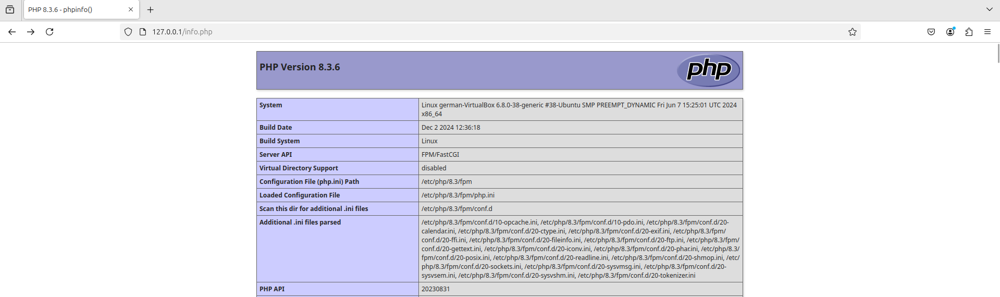
