# Instalación y configuración básica de NGINX

Actualizamos los paquetes:

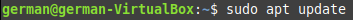

Instalamos NGINX:

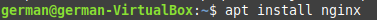

Vemos el status de NGINX:

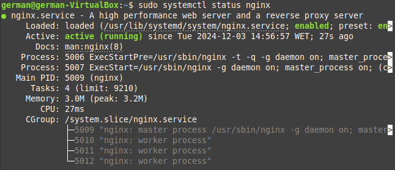

Comprobamos la configuración de NGINX:

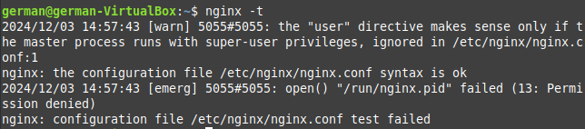

Entramos en /etc/nginx/ y hacemos un ls para ver qué hay en la carpeta

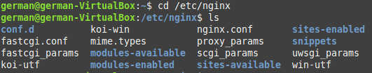

Entramos en /etc/nginx/sites-available y hacemos ls para ver los contenidos

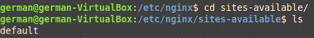

Entramos en sites-enabled y hacemos otro ls

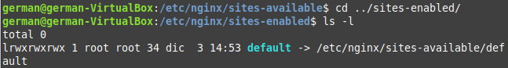

Hacemos un cat en default para ver los contenidos de la plantilla

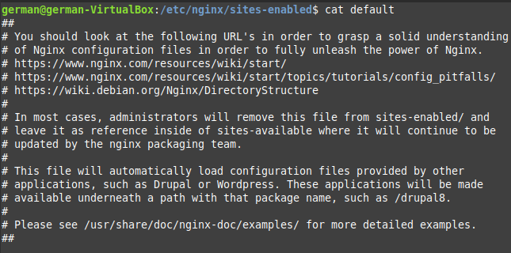
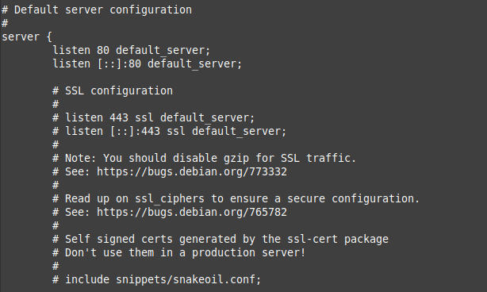
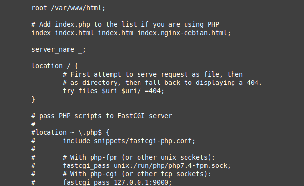

Vamos a /var/www/html para ver lo que tenemos dentro

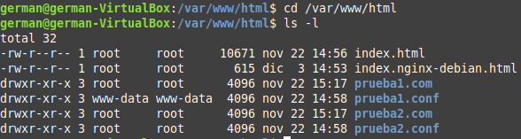

Reiniciamos NGINX

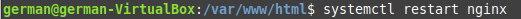

Quitamos index.nginx-debian.html y reescribimos el interior de index.html con algo que nosotros queramos

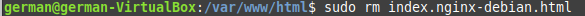
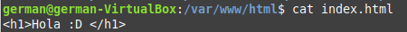

Reiniciamos NGINX de nuevo y ahora podemos acceder a nuestro html desde el buscador con "localhost"

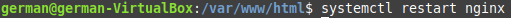