# Instalación de servidor DNS

Instalamos el paquete bind9

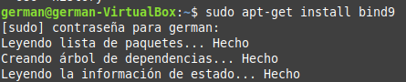

Comenzamos y habilitamos el servicio que acabamos de instalar

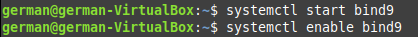

Aquí le damos acceso al puerto que tiene que usar

En la ruta /etc/bind/ le creamos un archivo llamado named.conf.options y le ponemos el siguiente código

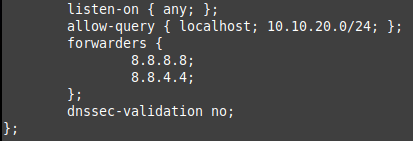

En la ruta /etc/default/ le creamos un archivo llamado named y modificamos esta linea de código para que quede así

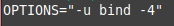

Comprobamos que esté todo bien escrito, reiniciamos el servicio y comprobamos que está activado

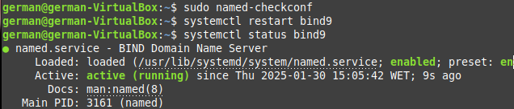

En la ruta /etc/bind/ le creamos un archivo llamado named.conf.local y modificamos esta linea de código para que quede así

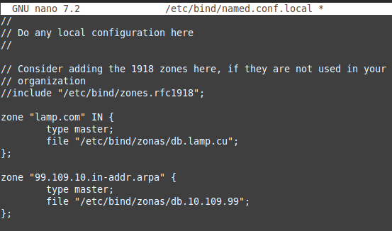

Creamos la siguiente carpeta y dentro creamos un fichero llamado db.(nombre-de-página)

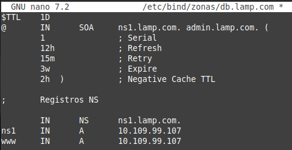

Dentro de esta misma carpeta creamos otro fichero llamado db.(tres-primeros-digitos-de-nuestra-ip-en-reverso) y le añadimos el siguiente código

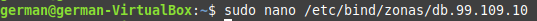

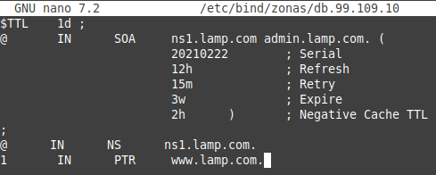

Con estos comandos comprobamos que todo lo que escribimos está correcto

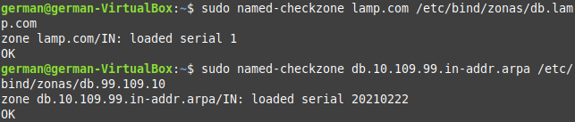

Y con el comando ping podemos ver que nuestro servidor DNS está funcionando correctamente

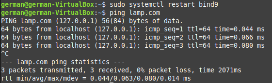