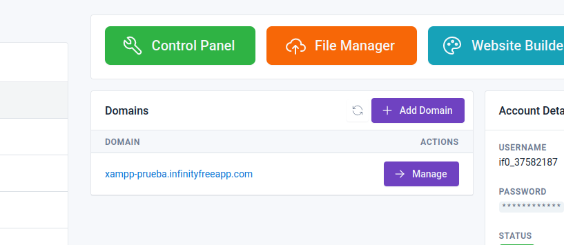
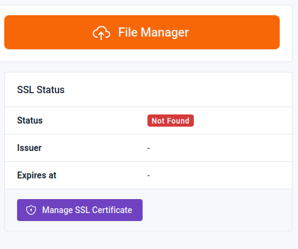
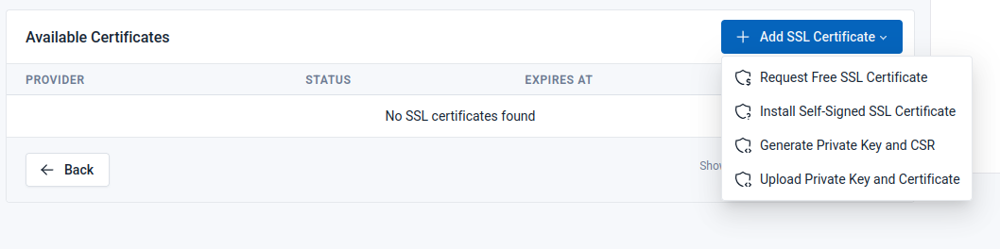
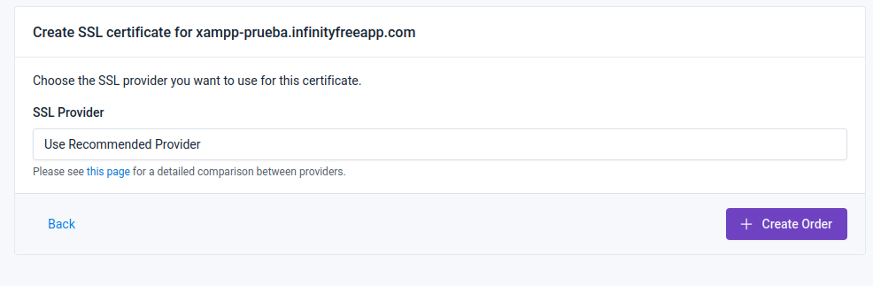
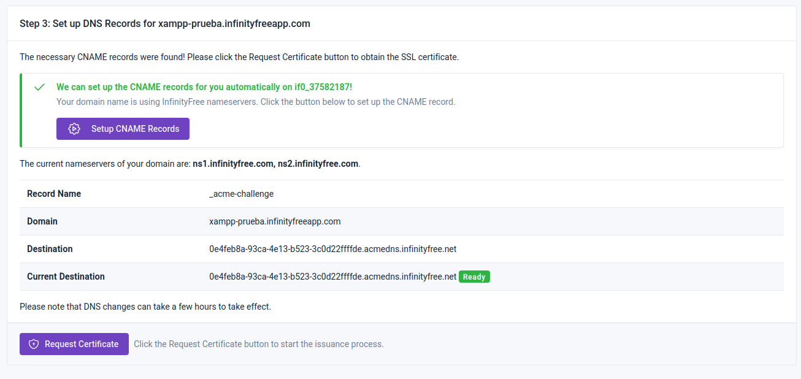
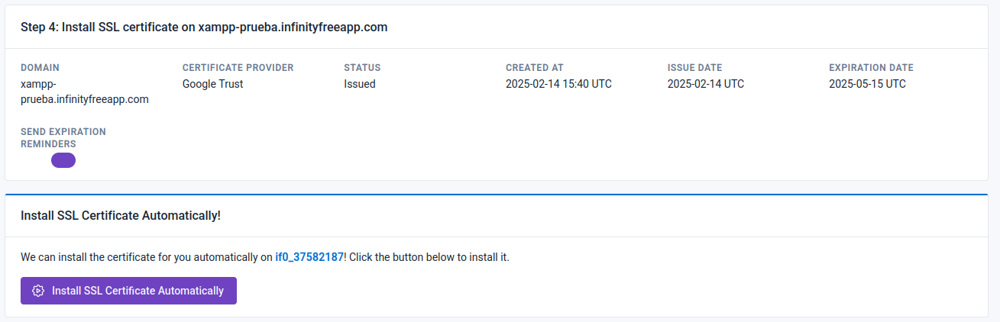
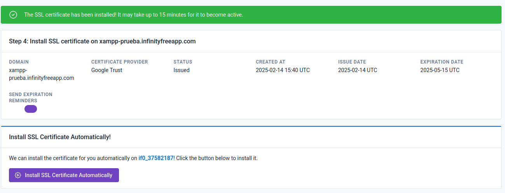

# Certificado SSL en la página de Infinityfreee

Entramos a nuestra cuentad e InfinityFree y en nuestros dominios hacemos click en el botón "manage" en el dominio al que queramos añadir el certificado SSL.

Dentro de la página de "manage" hacemos click en el botón de Manage SSL Certificate.

Dentro de esa página le damos al botón de "Add SSL Certificate" y escogemos la primera opción.

Después de escoger la primera opción, utilizamos la opción de "Use Recommended Provider" y creamos el pedido del certificado.

Cuando vengamos a esta página nos va a pedir tener los CNAME Records, para eso le damos al botón de "Setup CNAME Records" y ya estaría, después hacemos
click en "Request Certificate" para pedir nuestro certificado.

Una vez haya pasado las pruebas podremos instalar el certificado SSL en nuestra página de InfinityFree dandole al botón morado.

Una vez hayamos hecho click en ese botón nos aparecerá encima un mensaje en verde que nos dirá que el certificado ha sido instalado.

